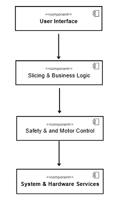

#Architektur

**Schichtenarchitektur**:

- Trennung der Verantwortlichkeiten (Hardwarenahe-Funktionen wie Spannung messen, Anwendungslogik wie Kalibrierung und
  Ladezustandsberechnung, Benutzeroberfläche)
- Jede Schicht ist unabhängig testbar und austauschbar
- Segmente nach funktionaler Rolle gruppiert → Kapselung und Entkopplung der Anwendung
- Jede Schicht darf nur die direkt darunterliegende Schicht ansprechen.
  -Es gibt keine Rückwärtssprünge oder Querkommunikation.

  ## Komponenten Diagramm

|# Komponenten | Kernaufgaben | Requirements |
| :---------------------- | :--------------------------------------------------------------------------------------------------- | :------------------------------------------------------------------------------------------------------------------------------------------------------------------------------------------------------------- |
| **4 User Interface (UI)** | Darstellung der Informationen und Verarbeitung der Benutzereingaben. | Req. 1.1, 1.2, 1.3, 1.4, 5.1, 5.2, 5.3, 5.4, 5.5, 5.6 |
| **3 Slicing and Business Logic (Core)** | Koordiniert die Abläufe, führt Berechnungen durch und implementiert die Kernfunktionen. | Req. 1.5, 1.6 , Req. 3.1, 3.2, 3.3  |
| **2 Safety & Motor Control** | Verwaltet alle sicherheitsrelevanten Grenzwerte, den Start/Stopp-Zustand und die Ansteuerung des Messers/Motors. | Req. 4.1, 4.2 , Req. 4.3, 4.4  |
| **1 System & Hardware Services** | Beinhaltet alle Dienste, die direkt mit der Hardware interagieren und Werte speichern. | Hardware Abstraction: Req. 2.1, 2.3 . Persistence: Req. 2.2 (Speicherung). Oder getrennt als Sub-Komponenten: |

**Verantwortlichkeiten der Komponenten:**

| # Komponente | Requirements | Grund für die Zuordnung |
| :---------- | :----------- | :---------------------- |
| **4 User Interface (UI)** | Req. 1.1, 1.2, 1.3, 1.4, 5.1-5.6 | Alle Anforderungen zur **Benutzereingabe und Anzeige**  |
| **3 Slicing & Business Logic** | Req. 1.5, 1.6, 2.3, 3.1, 3.2, 3.3 | Alle Anforderungen zur **Berechnung** und zur **Kalibrierung/Genauigkeit**|
| **2 Safety & Motor Control** | Req. 4.1, 4.2, 4.3, 4.4 | Alle Anforderungen zur **Sicherheit und Grenzwertüberwachung** |
| **1 System & Hardware Services** | Req. 2.1, 2.2 | Alle Anforderungen zur **direkten Messung**  und **Speicherung**  |

