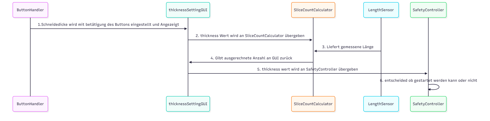

## Klassendiagramm
Klassendiagramm für die Requirements, die im ersten Sprint bearbeitet werden sollen

## Sequenzdiagramm:

## Kommunikationsdiagramm:

## Designpattern
| Klasse | Design-Pattern | Grund |
| :--- | :--- | :--- |
| **`SliceCountCalculator`** | **Adapter** | Übersetzt die von ThicknessSettingGUI erwartete Schnittstelle in die des vorhandenen Dienstes (`SliceCountHandlerServices`). Entkoppelt die Steuerung von der tatsächlichen Service-Implementierung und ermöglicht die Beschaffung notwendiger Daten (Länge) vor der Delegation. |
